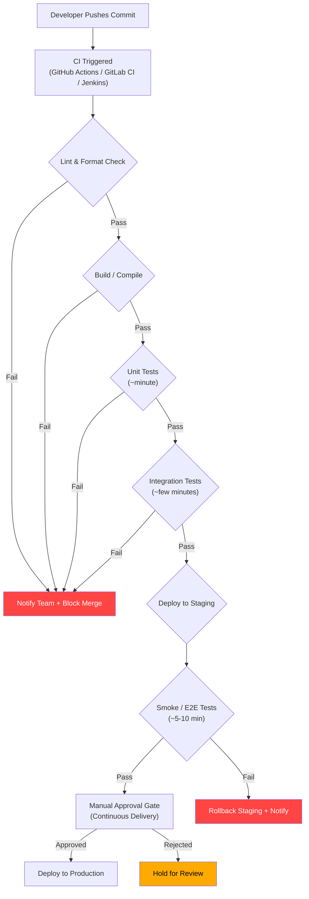

# CSE310 — Unit 3: TDD, CI/CD Pipelines, and Automated Testing Strategies

---

## 1. Overview — Why This Matters, Real-World Relevance

Modern software teams ship code to production dozens or hundreds of times per day. Without automated safety nets, every deployment risks breaking the system. Test-Driven Development (TDD) and Continuous Integration / Continuous Deployment (CI/CD) pipelines are the industry-standard practices that make rapid, reliable delivery possible.

TDD flips the traditional workflow — write the test *before* the code — ensuring every line is justified, tested, and designed around testability. CI/CD pipelines automate the build, test, and deployment process so that every commit is verified, integrated, and (in mature teams) shipped automatically.

These practices are not exclusive to FAANG companies. Mid-size firms, startups, and even open-source projects rely on them: a 2024 survey by the DevOps Research and Assessment (DORA) group found that elite-performing teams deploy 973x more frequently than low performers, with 6570x faster lead times — all driven by automated testing and CI/CD discipline.

**A real-world example:** In 2023, a major UK airline suffered a 36-hour outage because a deployment pipeline bypassed integration tests. A single database migration that worked in isolation caused cascading failures in production. The root cause? The CD pipeline had no automated rollback and no integration test stage. Teams with mature CI/CD recover from such failures in minutes, not days.

Together, TDD and CI/CD form the backbone of DevOps culture and are non-negotiable in any professional engineering org producing quality software at speed.

---

## 2. Key Concepts & Definitions

| Term | Definition |
|------|-----------|
| **Test-Driven Development (TDD)** | A software development process where you write a failing test before writing the production code, then write the minimum code to pass the test, then refactor. Cycle: **Red -> Green -> Refactor**. |
| **Red-Green-Refactor Cycle** | Red = write a test that fails; Green = write the minimal code to pass; Refactor = clean up without changing behavior. |
| **Continuous Integration (CI)** | A practice where developers merge their changes into a shared mainline branch multiple times daily, with each merge verified by an automated build and test suite. |
| **Continuous Deployment (CD)** | Every change that passes the CI pipeline is automatically deployed to production without manual intervention. |
| **Continuous Delivery** | Every change that passes CI is deployable, but deployment is triggered manually (not automatic). |
| **Test Suite** | The complete collection of test cases for a system. |
| **Unit Test** | Tests the smallest testable part (function, method, class) in isolation, without external dependencies (databases, networks, filesystems). |
| **Integration Test** | Tests that multiple units or modules work together correctly, often involving real or simulated external systems. |
| **End-to-End (E2E) Test** | Tests the full system from the user's perspective, through the entire stack (UI -> API -> DB). |
| **Regression Test** | A test that ensures previously working functionality hasn't broken after a change. The whole test suite becomes a regression suite. |
| **Mock** | A substitute object that simulates the behavior of a real dependency so you can test a unit in isolation. Mocks also verify interaction patterns (was the method called with the right arguments?). |
| **Stub** | A minimal implementation of a dependency that returns fixed values, used when you don't care about interaction verification — only about the return value. |
| **Fixture** | A fixed, known state of data used as a baseline for running tests. |
| **Coverage** | A metric (line, branch, or function) measuring what percentage of your code is executed during testing. High coverage does not guarantee good tests. |
| **Build Pipeline** | The sequence of automated stages (lint -> compile -> unit test -> integration test -> deploy) a commit passes through. |
| **Build Artifact** | The packaged output of a build (JAR, Docker image, binary) that can be deployed. |
| **Git Hook** | A script that runs automatically on a Git event (pre-commit, pre-push). Often used to run linters and fast tests locally before code reaches CI. |
| **Trunk-Based Development** | A branching model where all developers work on a single shared branch (typically main or trunk), using short-lived feature branches (hours to days) merged via small, frequent commits, or feature flags to gate incomplete work. Contrasts with GitFlow. |
| **Shift Left** | The practice of moving testing earlier in the development lifecycle (e.g., catching bugs at unit-test time instead of during system test). |
| **Regression** | A software bug that reintroduces a defect that was previously fixed, typically caused by refactoring or feature additions. |

---

## 3. Detailed Explanation — Deep Structured Explanation

### 3.1 The TDD Cycle (Red -> Green -> Refactor)

TDD is not "write some tests, then write code." It is a rigorous, beat-by-beat rhythm:

**Step 1 -- Red:** Write a test for the *next* piece of behavior you want to implement. The test should be specific enough that you know exactly what code would make it pass. Run it. It must fail (because the feature doesn't exist yet). If it passes, you wrote a vacuous test — delete it and write a meaningful one.

**Step 2 -- Green:** Write the *simplest possible* code to make the test pass. This is often a hardcoded return value. Resist the urge to write "production-quality" code here. The goal is to get to green as fast as possible.

**Step 3 -- Refactor:** Now that tests pass, clean up. Remove duplication, rename variables, extract functions, improve design. The test suite guarantees you didn't break anything.

Then repeat for the next piece of behavior. The cycle length is typically 30--120 seconds.

### 3.2 TDD Principles

- **YAGNI (You Ain't Gonna Need It):** Write only the code the tests demand. No speculative generality.
- **KISS (Keep It Simple, Stupid):** The simplest implementation that passes is the right one at that moment.
- **Test Isolation:** Each test must be independent. Tests should not share mutable state, should not depend on execution order, and should clean up after themselves.
- **Fake It 'Til You Make It:** Start by returning a hardcoded constant that makes the test pass; then gradually replace the fake with real logic as more tests force generalization.
- **Triangulation:** Write a second test with a different input/output expectation to force the implementation toward generality (e.g., after faking `isLeapYear(2000) -> true`, add `isLeapYear(2001) -> false`).

### 3.3 The Testing Pyramid

The testing pyramid is a visual metaphor for how many tests of each type you should write:

```
            /\
           /  \
          / E2E \
         /--------\
        /          \
       / Integration \
      /----------------\
     /                  \
    /   Unit Tests       \
   /______________________\
```

- **Base (Unit Tests):** 60--70% of your test suite. Fast, reliable, run on every commit.
- **Middle (Integration Tests):** 20--30%. Test component interactions. Slower but catch wiring errors.
- **Top (E2E Tests):** 5--10%. Test full user journeys. Slowest and most brittle; reserve for critical paths (login, checkout, payment).

### 3.4 CI/CD Pipeline Stages

A typical CI/CD pipeline runs these stages in sequence:

```
  [Commit] -> [Lint] -> [Build] -> [Unit Test] -> [Integration Test] -> [Deploy to Staging] -> [E2E Smoke] -> [Deploy to Prod]
```

Each stage acts as a gate: if it fails, the pipeline stops and the team is notified immediately. No broken commit reaches production.

---

## 4. TDD in Practice — Worked Code Example

The best way to understand TDD is to see it. Below is a full Red -> Green -> Refactor cycle for a simple `isLeapYear` function.

### Spec

Write a function `isLeapYear(year)` that returns `true` if:
- The year is divisible by 400, OR
- The year is divisible by 4 but NOT by 100.

### Cycle 1: Handle a year divisible by 400

**RED:** Write the test first.

```python
# test_leap.py
from leap import isLeapYear

def test_leap_year_divisible_by_400():
    assert isLeapYear(2000) is True
```

Run the test:
```
$ pytest test_leap.py
FAILED test_leap.py::test_leap_year_divisible_by_400 - ImportError: No module named 'leap'
```

It fails because `leap.py` does not exist yet. Red confirmed.

**GREEN:** Write the minimal code to pass.

```python
# leap.py
def isLeapYear(year):
    return True
```

Run the test:
```
$ pytest test_leap.py
PASSED test_leap.py::test_leap_year_divisible_by_400
```

Green achieved. This is intentionally hardcoded -- we have only one test case.

**REFACTOR:** Nothing to refactor yet. One line, no duplication. Move to the next behavior.

### Cycle 2: Handle a year NOT divisible by 4

**RED:** Add a second test case.

```python
def test_common_year_not_divisible_by_4():
    assert isLeapYear(2001) is False
```

Run:
```
$ pytest test_leap.py
FAILED test_leap.py::test_common_year_not_divisible_by_4 - AssertionError: assert True is False
```

Red confirmed. The hardcoded `True` now fails on the new input.

**GREEN:** Generalize the implementation just enough.

```python
def isLeapYear(year):
    if year % 400 == 0:
        return True
    return False
```

This passes the `2000` test (divisible by 400) and the `2001` test (not divisible by 400, returns `False`). But it's still wrong for years divisible by 4 but not 100.

### Cycle 3: Handle a year divisible by 4 but not 100

**RED:** Add a third test case.

```python
def test_leap_year_divisible_by_4_not_100():
    assert isLeapYear(2024) is True
```

Run:
```
$ pytest test_leap.py
FAILED test_leap.py::test_leap_year_divisible_by_4_not_100 - AssertionError: assert False is True
```

**GREEN:** Expand the implementation.

```python
def isLeapYear(year):
    if year % 400 == 0:
        return True
    if year % 100 == 0:
        return False
    if year % 4 == 0:
        return True
    return False
```

All three tests pass.

**REFACTOR:** Consolidate into a single boolean expression.

```python
def isLeapYear(year):
    return (year % 400 == 0) or (year % 4 == 0 and year % 100 != 0)
```

Run tests again to verify:
```
$ pytest test_leap.py
PASSED (3 passed)
```

The cycle is complete: we have a clean, correct implementation and a growing test suite that guards against regressions.

---

## 5. CI/CD Pipeline Architecture

### 5.1 Pipeline Flow Diagram

Below is a Mermaid flowchart of a complete CI/CD pipeline. Each diamond is a gate -- if the condition fails, the pipeline halts.



### 5.2 Key Pipeline Decisions

| Decision Point | What Happens | Why It Matters |
|---------------|-------------|----------------|
| **Lint/Format gate** | Prevents commits with style violations or syntax errors from proceeding. | Catches trivial issues before they waste build minutes. |
| **Parallel vs. serial stages** | Unit tests often run in parallel across multiple OS or Node versions; integration and E2E run serially. | Parallel execution keeps feedback fast; serial gates prevent cascading failures. |
| **Artifact promotion** | Only artifacts that passed all stages are tagged and promoted to production. | Ensures exactly what was tested is what gets deployed (no rebuild). |
| **Rollback strategy** | If CD deploys a bad release, the pipeline automatically re-deploys the previous known-good artifact. | Limits blast radius of a bad deployment to minutes. |

---

## 6. Testing Strategies and Classification

### 6.1 When to Write Each Test Type

| Test Type | Writes By | Runs On | Purpose |
|-----------|-----------|---------|---------|
| Unit | Developer during TDD | Every commit | Catch logic errors at the smallest granularity |
| Integration | Developer + QA | CI per commit | Catch wiring/contract errors between modules |
| E2E | QA / SDET | Nightly or per release | Catch full-stack user-facing regressions |
| Performance | QA / SRE | Pre-release | Catch slowdowns and memory leaks |
| Security | Security team | Pre-release | Catch vulnerabilities |

### 6.2 The FIRST Principles of Good Unit Tests

- **Fast** -- Tests should run in milliseconds. If a unit test takes seconds, it's probably an integration test.
- **Isolated** -- Each test runs independently. No shared state, no order dependence.
- **Repeatable** -- Same result every time, on any machine. No flaky network or timezone dependencies.
- **Self-checking** -- The test framework decides pass/fail automatically. No manual inspection.
- **Timely** -- Written *before* the code (TDD), not as an afterthought.

### 6.3 Mock vs. Stub: When to Use What

| Scenario | Use | Reason |
|----------|-----|--------|
| You only need a return value | **Stub** | Minimal, no interaction tracking |
| You need to verify a method was called with specific args | **Mock** | Interaction-based testing (e.g., did the logger receive the error message?) |
| The dependency is slow (database, network) | **Mock** | Replace with a lightweight fake to keep test fast |
| The dependency has complex setup (file system, clock) | **Mock** | Avoid real I/O |

---

## 7. Tools and Implementation Guide

### 7.1 Common Testing and CI Tools by Language

| Tool | Category | Language / Platform | Key Command |
|------|----------|-------------------|-------------|
| **Jest** | Unit/Integration testing | JavaScript / TypeScript | `npx jest --coverage` |
| **Vitest** | Unit/Integration testing | JavaScript / TypeScript (Vite ecosystem) | `npx vitest --coverage` |
| **pytest** | Unit/Integration testing | Python | `pytest --cov=src tests/` |
| **JUnit 5** | Unit/Integration testing | Java / Kotlin | `./gradlew test` |
| **Go testing** | Unit testing | Go | `go test -cover ./...` |
| **Mockito** | Mocking framework | Java | Used within JUnit tests to mock dependencies |
| **unittest.mock** | Mocking framework | Python | `from unittest.mock import Mock` |
| **msvc** / **sinon.js** | Mocking framework | JavaScript | `sinon.stub(obj, 'method')` |
| **GitHub Actions** | CI/CD platform | Multi-language (YAML config) | `.github/workflows/ci.yml` |
| **GitLab CI** | CI/CD platform | Multi-language (YAML config) | `.gitlab-ci.yml` |
| **Jenkins** | CI/CD platform | Multi-language (Groovy config) | `Jenkinsfile` |
| **Docker** | Build artifact + env isolation | Multi-language | `docker build -t app . && docker push` |
| **ESLint** | Linter | JavaScript / TypeScript | `npx eslint src/` |
| **Flake8** | Linter / Format check | Python | `flake8 src/` |

### 7.2 Minimal GitHub Actions CI Example

```yaml
# .github/workflows/ci.yml
name: CI Pipeline

on: [push, pull_request]

jobs:
  test:
    runs-on: ubuntu-latest
    steps:
      - uses: actions/checkout@v4
      - uses: actions/setup-node@v4
        with:
          node-version: 20
      - run: npm ci
      - run: npm run lint
      - run: npm test -- --coverage
      - run: npm run build
```

This pipeline triggers on every push, installs dependencies, runs lint, runs tests with coverage, and verifies the build compiles. If any step fails, the pipeline shows red; the PR cannot merge.

### 7.3 Setting Up Git Hooks (Local Gate)

```bash
# .git/hooks/pre-commit
#!/bin/sh
npm run lint && npm test -- --changed
```

This runs before every commit, catching issues before they reach CI.

### 7.4 Coverage Threshold Configuration

```json
// package.json (Jest config)
{
  "jest": {
    "collectCoverageFrom": ["src/**/*.{js,ts}"],
    "coverageThreshold": {
      "global": {
        "branches": 80,
        "functions": 80,
        "lines": 80,
        "statements": 80
      }
    }
  }
}
```

Setting thresholds in CI (e.g., `--coverageThreshold`) ensures the pipeline fails if coverage drops below the minimum.

---

## 8. Common Pitfalls and Anti-Patterns

| Pitfall | Why It's Dangerous | How to Avoid |
|---------|-------------------|--------------|
| **Testing implementation details** | Tests fail on refactoring even when behavior is correct. | Test *behavior*, not internal methods or private state. |
| **Flaky tests** | Tests that pass sometimes and fail randomly erode trust in the suite. Seed random values, freeze time, mock network calls. | Use `time-machine` or `@mock.patch('time.time')`; avoid real network in unit tests. |
| **Over-mocking** | Mocking everything makes tests pass but hide real integration bugs. | Use real objects for value types (strings, numbers, dates); mock only I/O boundaries. |
| **Giant integration test suites** | Slow CI pipelines discourage running tests before push. | Follow the testing pyramid: more unit, fewer integration, minimal E2E. |
| **No local pre-commit gate** | Developers push broken code and wait minutes for CI to tell them. | Add a `pre-commit` hook that runs lint and fast tests. |
| **Silent pipeline failures** | A red pipeline is ignored because it "always fails." | Set branch protection rules: CI must pass before merge is allowed. |
| **Hardcoded test data duplication** | Changing schema means updating dozens of test files. | Use shared fixtures and factories (e.g., factory_boy, faker). |

---

## 9. Practice Problems

### Problem 1: TDD Cycle -- Shopping Cart Total

**Spec:** Implement a function `cart_total(items)` that takes a list of `(price, quantity)` tuples and returns the sum of `price * quantity` for all items.

Write the test cases and implementation following the Red -> Green -> Refactor cycle. Start with:
- Empty cart returns `0.0`
- Single item: `[(10.0, 2)]` returns `20.0`
- Multiple items: `[(5.0, 3), (2.0, 10)]` returns `35.0`

### Problem 2: CI Pipeline Debugging

**Scenario:** Your team's CI pipeline is failing with this log:

```
$ npm run test -- --coverage
...
TOTAL: 72.5% branch coverage (threshold: 80%)
ERROR: Coverage threshold for branches not met.
```

**Questions:**
1. Which stage of the pipeline gates this check?
2. List three approaches to fix this (without just lowering the threshold).
3. If you must deploy a critical hotfix today, how would you handle this?

### Problem 3: Mock vs. Stub Selection

**Scenario:** You are testing a function `send_welcome_email(user)` that:
- Looks up the user in the database to get their email address
- Formats an HTML template
- Sends the email via an SMTP client
- Logs the send result

**Task:** For each dependency (database lookup, template rendering, SMTP client, logger), decide whether to use a mock or a stub. Justify each decision.

### Problem 4: Testing Strategy Design

**Scenario:** Your team is building a payment processing system with three components:
- A **web UI** for users to enter card details
- A **REST API** that validates and processes payments
- A **background worker** that settles transactions with the bank

**Task:** Design a testing strategy. For each component, specify:
1. Which test types (unit, integration, E2E) apply
2. What tools you would use
3. How you would mock external dependencies (the bank API, in particular)

### Problem 5: Trunk-Based Development Simulation

**Scenario:** Two developers are working on the same codebase. Developer A adds a new API endpoint; Developer B refactors the authentication middleware. They both branch from `main` at the same commit.

**Questions:**
1. If they merge in the wrong order, what could go wrong?
2. How does CI catch this?
3. How does TDD help prevent this before a merge conflict even occurs?

---

## 10. Quick Reference / Summary

### Red -> Green -> Refactor Cheat Sheet

```
1. RED:    Write a failing test                -> Run it; see it fail
2. GREEN:  Write minimal code to pass          -> Run it; see it pass
3. REFACTOR: Clean up without changing behavior -> Run it; still passes
4. REPEAT
```

### Testing Pyramid (Layer Count Guide)

| Layer | Proportion | Speed | Runs On |
|-------|-----------|-------|---------|
| Unit tests | ~60--70% | ms each | Every commit |
| Integration tests | ~20--30% | seconds each | Every commit |
| E2E tests | ~5--10% | minutes each | Staging deploy or nightly |

### CI/CD Pipeline Stage Sequence

```
Commit -> Lint -> Build -> Unit Test -> Integration Test -> Staging -> E2E Smoke -> Prod
   ^                                                                                     |
   |___________________ Rollback to previous artifact ___________________________________|
```

### Key CLI Commands

| Task | Command |
|------|---------|
| Run unit tests (JS) | `npx vitest run` or `npx jest` |
| Run with coverage | `npx vitest --coverage` |
| Run unit tests (Python) | `pytest` |
| Run with coverage (Python) | `pytest --cov=src tests/` |
| Run unit tests (Java) | `./gradlew test` or `mvn test` |
| Run linter (JS) | `npx eslint src/` |
| Run linter (Python) | `flake8 src/` |
| Build Docker image | `docker build -t app .` |
| Push Docker image | `docker push registry/app:tag` |

### Branching Strategy Quick Comparison

| Model | Merge Frequency | CI Suitability | Use Case |
|-------|----------------|----------------|----------|
| **Trunk-Based** | Multiple times daily | Excellent | Teams practicing CD, short-lived branches |
| **GitFlow** | Per release | Moderate | Large projects with scheduled releases, hotfix branches |

---

## 11. Further Reading and References

### Essential Reading
- Beck, K. (2002). *Test-Driven Development: By Example*. Addison-Wesley. -- The foundational text on TDD from its creator.
- Humble, J. & Farley, D. (2010). *Continuous Delivery: Reliable Software Releases Through Build, Test, and Deployment Automation*. Addison-Wesley. -- The definitive guide to CI/CD.
- Fowler, M. (2021). "TestPyramid." martinfowler.com. https://martinfowler.com/bliki/TestPyramid.html

### Online Resources
- GitHub Actions Documentation: https://docs.github.com/en/actions
- pytest Documentation: https://docs.pytest.org/
- Vitest Documentation: https://vitest.dev/
- "Continuous Integration" by Martin Fowler: https://martinfowler.com/articles/continuousIntegration.html

### Standard References
- DORA (2024). *Accelerate State of DevOps Report*. Google Cloud.
- ISTQB (2023). *ISTQB Certified Tester Foundation Level Syllabus v4.0*. International Software Testing Qualifications Board.

---

*End of Unit 3 Study Notes -- CSE310: Software Engineering*
