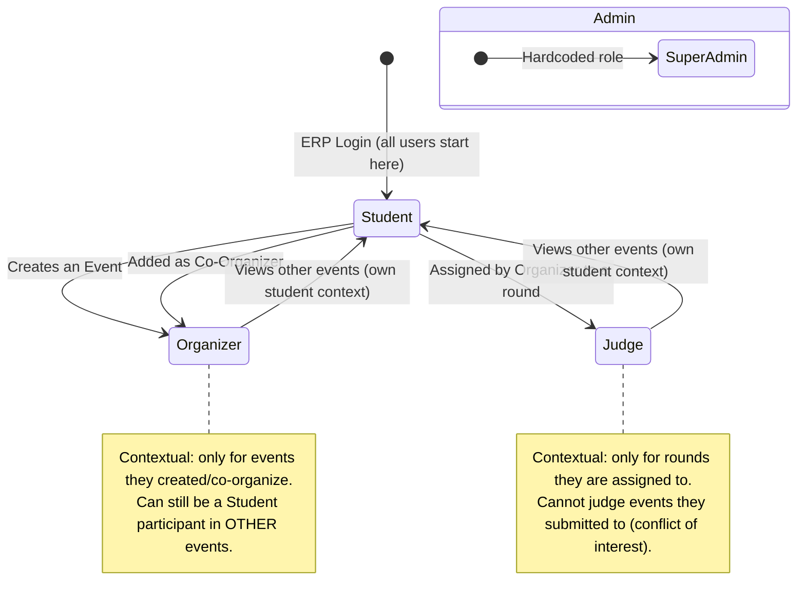
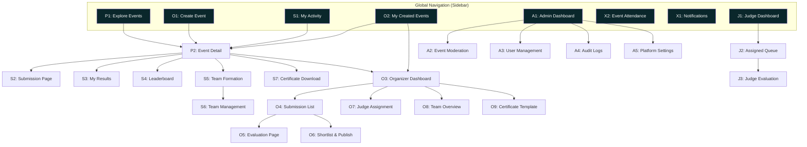
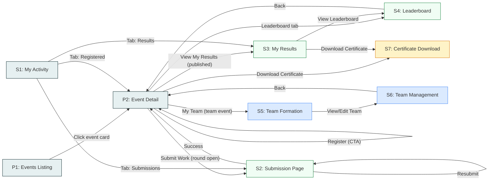
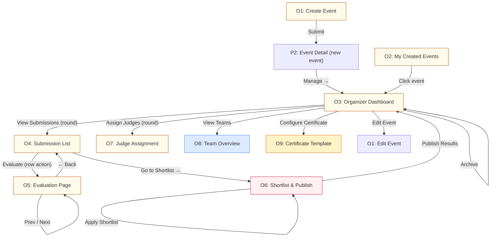
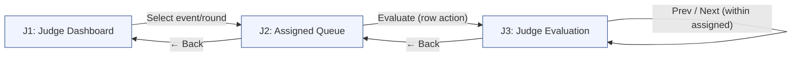
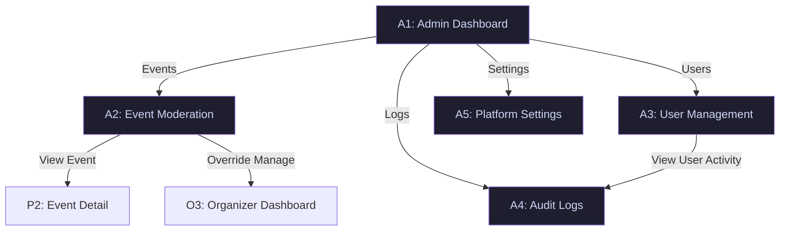
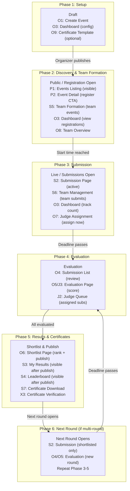
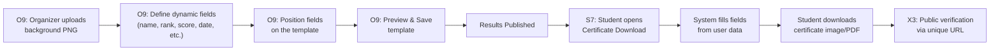
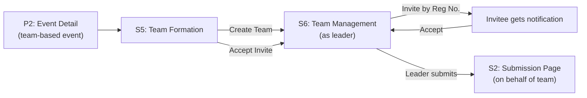

# Competition Platform — Flow Architecture & Stakeholder Map

> **Version:** 1.1  
> **Scope:** All pages, navigation paths, role transitions, and stakeholder access for the Competition Platform module  
> **Base System:** University ERP Companion Platform

---

## 1. Stakeholder Definitions

| # | Stakeholder | Identity | How They Get This Role | Core Goal |
|---|-------------|----------|----------------------|-----------|
| 1 | **Student** | Any authenticated SRM student | Login via ERP credentials | Discover events, register, submit work, view results |
| 2 | **Organizer** | Creator or co-organizer of an event | Creates an event OR is added as co-organizer by creator | Configure competition, evaluate submissions, publish results |
| 3 | **Judge** | External evaluator assigned by an organizer | Organizer assigns them to specific rounds | Score submissions against rubric, provide remarks |
| 4 | **Admin** | Platform owner (you + future partners) | Hardcoded super-admin role | Moderate content, manage platform settings, view analytics |

> [!IMPORTANT]
> **Contextual Roles:** A single user can hold multiple roles simultaneously. A Student who creates an event becomes an Organizer *for that event*. A Student assigned as Judge becomes a Judge *for that event's rounds*. Their Student identity persists across all contexts.

---

## 2. Role Transition Diagram



### Role Transition Rules

| Transition | Trigger | Reversible? | Constraint |
|------------|---------|-------------|------------|
| Student → Organizer | User creates an event via `/events/create` | Yes — archive all events to lose organizer context | Max 3 active competitions per user |
| Student → Co-Organizer | Event creator adds their register number | Yes — creator removes them | Same permissions as creator for that event |
| Student → Judge | Organizer assigns them on the Judge Assignment page | Yes — organizer unassigns | Cannot judge own submissions (API-enforced 403) |
| Any → Admin | System-level flag | No | Not a contextual role; always active |

---

## 3. Complete Page Inventory

Pages are organized by domain. Each page lists its route, which stakeholders can access it, and its purpose. Pages from the original plans that were **removed** are listed in §3.7 with rationale.

---

### 3.1 Public / Discovery Pages

| # | Page | Route | Access | Purpose |
|---|------|-------|--------|---------|
| P1 | **Events Listing** | `/events` | All (Student, Organizer, Judge, Admin) | Browse/filter/search all public events and competitions |
| P2 | **Event Detail** | `/events/:eventId` | All | View event info, rounds, timeline, prizes, rules, FAQ, leaderboard |

---

### 3.2 Student Pages

| # | Page | Route | Access | Purpose |
|---|------|-------|--------|---------|
| S1 | **My Activity** | `/events/my-activity` | Student | Tabs: Registered Events, My Submissions, My Results |
| S2 | **Submission** | `/events/:eventId/submit/:roundId` | Student (registered participant) | Upload file or link for a competition round |
| S3 | **My Results** | `/events/:eventId/my-results/:roundId` | Student (registered participant) | View score breakdown, rank, decision after results are published |
| S4 | **Leaderboard** | `/events/:eventId/leaderboard/:roundId` | Student (registered participant) + Organizer + Admin | View rankings after results are published |
| S5 | **Team Formation** | `/events/:eventId/teams` | Student (registered participant) | Create a team, invite members by register number, accept/decline invites |
| S6 | **Team Management** | `/events/:eventId/teams/:teamId` | Student (team member) | View/edit team, manage members; team leader submits on behalf of team |
| S7 | **Certificate Download** | `/events/:eventId/certificate` | Student (registered participant) | Download auto-generated certificate after results published |

---

### 3.3 Organizer Pages

| # | Page | Route | Access | Purpose |
|---|------|-------|--------|---------|
| O1 | **Create Event** | `/events/create` | Student (becomes Organizer upon creation) | Multi-step event/competition creation wizard |
| O2 | **My Created Events** | `/events/my-created` | Organizer | List all events created by the user, active competition counter |
| O3 | **Organizer Dashboard** | `/events/:eventId/manage` | Organizer (creator + co-organizers) | Command center: stats, round status, participant table, actions |
| O4 | **Submission List** | `/events/:eventId/manage/rounds/:roundId/submissions` | Organizer | Table of all submissions for a round with evaluation status |
| O5 | **Evaluation** | `/events/:eventId/manage/rounds/:roundId/submissions/:id/evaluate` | Organizer + Judge (assigned) | Score a submission against criteria, add remarks, flag |
| O6 | **Shortlist & Publish** | `/events/:eventId/manage/rounds/:roundId/shortlist` | Organizer | Rank, shortlist (Top N / threshold), and publish results |
| O7 | **Judge Assignment** | `/events/:eventId/manage/rounds/:roundId/judges` | Organizer | Assign/unassign judges to a round, view assignment status |
| O8 | **Team Overview** | `/events/:eventId/manage/teams` | Organizer | View all teams, member lists, submission status per team |
| O9 | **Certificate Template Designer** | `/events/:eventId/manage/certificates` | Organizer | Upload background PNG, define dynamic field positions (name, rank, score, event title, date), preview and save template |

---

### 3.4 Judge Pages

| # | Page | Route | Access | Purpose |
|---|------|-------|--------|---------|
| J1 | **Judge Dashboard** | `/events/judge-dashboard` | Judge | List of events/rounds the user is assigned to judge |
| J2 | **Assigned Queue** | `/events/:eventId/judge/rounds/:roundId/queue` | Judge (assigned to round) | Queue of submissions awaiting their evaluation |
| J3 | **Judge Evaluation** | `/events/:eventId/judge/rounds/:roundId/submissions/:id/evaluate` | Judge (assigned to round) | Same evaluation UI as O5 but scoped to assigned submissions |

> [!NOTE]
> J3 (Judge Evaluation) and O5 (Organizer Evaluation) share the same `EvaluationPage` component. The difference is access control: Judges see only their assigned submissions. Organizers see all.

---

### 3.5 Admin Pages

| # | Page | Route | Access | Purpose |
|---|------|-------|--------|---------|
| A1 | **Admin Dashboard** | `/admin` | Admin | Platform-wide analytics: total events, active competitions, user engagement |
| A2 | **Event Moderation** | `/admin/events` | Admin | Review/flag/archive any event, override visibility |
| A3 | **User Management** | `/admin/users` | Admin | View users, assign/revoke admin roles, view activity history |
| A4 | **Audit Logs** | `/admin/audit` | Admin | Chronological log of all significant actions across the platform |
| A5 | **Platform Settings** | `/admin/settings` | Admin | Global config: file size limits, allowed MIME types, rate limits |

---

### 3.6 Shared / Cross-Cutting Pages

| # | Page | Route | Access | Purpose |
|---|------|-------|--------|---------|
| X1 | **Notifications** | `/events/notifications` | All authenticated | Notification center: submission confirmations, results, deadlines |
| X2 | **Event Attendance** | `/events/attendance` | Student | ERP-domain attendance tracking (existing, unchanged) |
| X3 | **Certificate Verification** | `/certificates/:certId` | Public (no auth required) | Verify authenticity of a certificate via unique ID/URL |

---

### 3.7 Removed Pages (from original plans) with Rationale

| Original Page | Source | Why Removed |
|---------------|--------|-------------|
| Landing Page / Marketing | Architecture v2 (Screen 6, 41) | University-internal platform; all users are already authenticated. No need for a public marketing page. |
| Public Club Profile | Architecture v2 (Screen 13, 141) | Clubs are not part of the competition platform scope. Events are organized by individuals, not clubs. |
| Waitlist | Architecture v2 (Screen 163) | Over-engineering. Registration is open/closed. Capacity limits handle this. |
| Check-in Pass / QR | Architecture v2 (Screen 11) | Existing ERP attendance system covers this. Separate check-in pass is redundant. |
| Achievements / Badges | Architecture v2 (Screen 21) | Gamification is out of scope — unnecessary complexity for an internal platform. |
| Points Wallet | Architecture v2 (Screen 175) | No points/rewards system. Out of scope. |
| Resume Insights | Architecture v2 (Screen 128) | Career features are a separate product. Not competition-related. |
| Volunteer Management | Architecture v2 (Screen 162) | Separate logistics system. Not part of submission→evaluation→results flow. |
| Sponsor Management | Architecture v2 (Screen 151) | No sponsorship system. Out of scope. |
| Budget Tracker | Architecture v2 (Screen 150) | Financial management is a separate concern. |
| Event Chat / Team Chat / Inbox | Architecture v2 (Screen 98, 110, 59) | Real-time messaging is a major subsystem. Announcements via broadcast are sufficient. |
| Mobile Companion views | Architecture v2 (Screen 91, 189, etc.) | Responsive web handles mobile. No separate mobile app. |
| Faculty Coordinator dashboard | Architecture v2 | Not one of the 4 stakeholders. Can be Admin sub-role in future. |
| Department Performance | Architecture v2 (Screen 123) | Admin analytics covers this at a higher level. |

---

## 4. Access Control Matrix

> ✅ = Full access &nbsp;&nbsp; 👁️ = Read-only &nbsp;&nbsp; 🔒 = Conditional &nbsp;&nbsp; ❌ = No access

| Page | Student | Organizer (own event) | Judge (assigned) | Admin |
|------|---------|----------------------|------------------|-------|
| **P1** Events Listing | ✅ | ✅ | ✅ | ✅ |
| **P2** Event Detail | ✅ | ✅ | ✅ | ✅ |
| **S1** My Activity | ✅ | ✅ (as student) | ✅ (as student) | ✅ |
| **S2** Submission | 🔒 Registered + round open + not blocked | ❌ own event | ❌ | ❌ |
| **S3** My Results | 🔒 After results published | ❌ own event | ❌ | 👁️ |
| **S4** Leaderboard | 🔒 After results published | ✅ | 👁️ | ✅ |
| **S5** Team Formation | 🔒 Registered + team-based event | ❌ own event | ❌ | ❌ |
| **S6** Team Management | 🔒 Team member | ❌ own event | ❌ | 👁️ |
| **S7** Certificate Download | 🔒 After results published + cert configured | ❌ own event | ❌ | 👁️ |
| **O1** Create Event | ✅ (≤3 active limit) | ✅ | ✅ (as student) | ✅ |
| **O2** My Created Events | ✅ | ✅ | ✅ (as student) | ✅ |
| **O3** Organizer Dashboard | ❌ | ✅ | ❌ | ✅ Override |
| **O4** Submission List | ❌ | ✅ | 🔒 Assigned subs only | ✅ Override |
| **O5** Evaluation | ❌ | ✅ (not own submission) | ✅ (assigned only, not own) | ✅ Override |
| **O6** Shortlist & Publish | ❌ | ✅ | ❌ | ✅ Override |
| **O7** Judge Assignment | ❌ | ✅ | ❌ | ✅ Override |
| **O8** Team Overview | ❌ | ✅ | ❌ | ✅ Override |
| **O9** Certificate Template | ❌ | ✅ | ❌ | ✅ Override |
| **J1** Judge Dashboard | ❌ | ❌ | ✅ | ✅ |
| **J2** Assigned Queue | ❌ | ❌ | ✅ | ✅ |
| **J3** Judge Evaluation | ❌ | ❌ | ✅ (assigned, not own) | ✅ |
| **A1–A5** Admin pages | ❌ | ❌ | ❌ | ✅ |
| **X1** Notifications | ✅ | ✅ | ✅ | ✅ |
| **X2** Event Attendance | ✅ | ✅ | ✅ | ✅ |
| **X3** Certificate Verification | ✅ (public) | ✅ (public) | ✅ (public) | ✅ |

> [!WARNING]
> **Conflict of Interest Rule:** Regardless of role, no user can evaluate a submission where `submission.submittedBy === currentUserId`. The API enforces this with a `403 Forbidden`.

---

## 5. Navigation Flow Trees

### 5.1 Master Navigation Map



---

### 5.2 Student Journey Flow



**Key decisions along the path:**

| At Page | User Decision | Outcome |
|---------|--------------|---------|
| P1 (Listing) | Click event | → P2 (Detail) |
| P2 (Detail) | Register | Stay on P2, status updates |
| P2 (Detail) | Submit Work | → S2 (Submission) — only if registered + round open + not blocked |
| S2 (Submission) | Choose File or Link | File: upload zone. Link: URL input. |
| S2 (Submission) | Submit | → Back to P2 with success status |
| P2 (Detail) | My Team | → S5 (Team Formation) — only if team-based event |
| S5 (Team Formation) | Create / Join team | → S6 (Team Management) |
| P2 (Detail) | View Results | → S3 — only after results published |
| S3 (Results) | View Leaderboard | → S4 |
| S3 (Results) | Download Certificate | → S7 — only if organizer configured a certificate template |
| P2 (Detail) | Download Certificate | → S7 — shortcut from event detail |

---

### 5.3 Organizer Journey Flow



**Organizer lifecycle per round:**

```
Create Event → Wait for submissions → View Submission List 
→ Evaluate each (one by one, Prev/Next) → Assign Judges (optional)
→ Open Shortlist Tool → Apply Shortlist → Publish Results
→ Configure Certificate Template → Participants can download certificates
```

---

### 5.4 Judge Journey Flow



**Judge constraints:**
- Judges only see submissions assigned to them (not the full round list)
- Judges cannot shortlist or publish — evaluation only
- Judges cannot evaluate their own submissions (403)

---

### 5.5 Admin Journey Flow



---

## 6. Sidebar Navigation Structure

The sidebar adapts based on the user's active roles:

```
┌─────────────────────────────────────────┐
│  Competition Platform                    │
│                                          │
│  ▸ Explore Events          [ALL]         │
│                                          │
│  ▸ My Competitions         [STUDENT]     │
│      ├─ My Activity                      │
│      ├─ (inline tabs: Submissions,       │
│      │   Results)                        │
│      └─ My Teams                         │
│                                          │
│  ▸ Organize                [ORGANIZER]   │
│      ├─ My Created Events                │
│      └─ Create Event                     │
│                                          │
│  ▸ Judge Panel             [JUDGE]       │
│      └─ My Assignments                   │
│                                          │
│  ▸ Event Attendance        [ALL/ERP]     │
│                                          │
│  ▸ 🔔 Notifications        [ALL]         │
│                                          │
│  ── Admin ──────────────── [ADMIN ONLY]  │
│  ▸ Dashboard                             │
│  ▸ Event Moderation                      │
│  ▸ Users                                 │
│  ▸ Audit Logs                            │
│  ▸ Settings                              │
└─────────────────────────────────────────┘
```

**Visibility rules:**
- "My Teams" appears inside My Competitions only if the user is a member of at least 1 team
- "Organize" section appears once a user has created at least 1 event (or always show with empty state)
- "Judge Panel" appears only if the user has at least 1 active judge assignment
- "Admin" section appears only for users with the admin flag

---

## 7. Page Connection Map (Adjacency)

This table shows direct navigation links between pages (can reach in 1 click):

| From Page | Can Navigate To |
|-----------|----------------|
| **P1** Events Listing | → P2 (click card), → O1 (create button) |
| **P2** Event Detail | → S2 (submit CTA), → S3 (results CTA), → S4 (leaderboard tab), → S5 (my team), → S7 (certificate), → O3 (manage link), → P1 (back) |
| **S1** My Activity | → P2 (click event), → S2 (click submission), → S3 (click result) |
| **S2** Submission | → P2 (back / success), → S2 (resubmit) |
| **S3** My Results | → S4 (leaderboard link), → S7 (download certificate), → P2 (back) |
| **S4** Leaderboard | → P2 (back), → O5 (organizer: evaluate link) |
| **S5** Team Formation | → S6 (view/edit team), → P2 (back) |
| **S6** Team Management | → P2 (back to event), → S5 (back to teams) |
| **S7** Certificate Download | → X3 (share verification link), → P2 (back) |
| **O1** Create Event | → P2 (after creation) |
| **O2** My Created Events | → O3 (click event), → P2 (view public page), → O1 (create new) |
| **O3** Organizer Dashboard | → O4 (view submissions), → O7 (assign judges), → O8 (view teams), → O9 (certificate template), → O1 (edit event), → P2 (view public) |
| **O4** Submission List | → O5 (evaluate row), → O6 (shortlist button), → O3 (back) |
| **O5** Evaluation | → O5 (prev/next), → O4 (back to list) |
| **O6** Shortlist & Publish | → O3 (after publish), → O4 (back) |
| **O7** Judge Assignment | → O3 (back) |
| **O8** Team Overview | → S6 (view team detail), → O3 (back) |
| **O9** Certificate Template | → O3 (back after save) |
| **J1** Judge Dashboard | → J2 (select round) |
| **J2** Assigned Queue | → J3 (evaluate), → J1 (back) |
| **J3** Judge Evaluation | → J3 (prev/next), → J2 (back) |
| **A1** Admin Dashboard | → A2, A3, A4, A5 |
| **A2** Event Moderation | → P2 (view event), → O3 (override manage) |
| **X3** Certificate Verification | (standalone — no auth required, no outbound nav) |

---

## 8. Competition Lifecycle & Page Mapping

This maps each phase of a competition's lifecycle to which pages are active and for whom:



---

## 9. Route Summary Table

| Route | Page | Component | Guard |
|-------|------|-----------|-------|
| `/events` | Events Listing | `EventsListingPage` | Auth only |
| `/events/create` | Create Event | `CreateEventPage` | Auth only |
| `/events/my-activity` | My Activity | `MyActivityPage` | Auth only |
| `/events/my-created` | My Created Events | `MyCreatedEventsPage` | Auth only |
| `/events/attendance` | Event Attendance | `EventAttendancePage` | Auth only (ERP) |
| `/events/notifications` | Notifications | `NotificationsPage` | Auth only |
| `/events/judge-dashboard` | Judge Dashboard | `JudgeDashboardPage` | Judge role |
| `/events/:eventId` | Event Detail | `EventDetailPage` | Auth + EventProvider |
| `/events/:eventId/submit/:roundId` | Submission | `SubmissionPage` | Registered + Round open |
| `/events/:eventId/my-results/:roundId` | My Results | `MyResultsPage` | Registered |
| `/events/:eventId/leaderboard/:roundId` | Leaderboard | `LeaderboardPage` | Results published |
| `/events/:eventId/teams` | Team Formation | `TeamFormationPage` | Registered + team event |
| `/events/:eventId/teams/:teamId` | Team Management | `TeamManagementPage` | Team member |
| `/events/:eventId/certificate` | Certificate Download | `CertificateDownloadPage` | Registered + results published + cert configured |
| `/events/:eventId/manage` | Organizer Dashboard | `OrganizerDashboard` | OrganizerGuard |
| `/events/:eventId/manage/rounds/:roundId/submissions` | Submission List | `SubmissionListPage` | OrganizerGuard |
| `/events/:eventId/manage/rounds/:roundId/submissions/:id/evaluate` | Evaluation | `EvaluationPage` | OrganizerGuard OR JudgeGuard |
| `/events/:eventId/manage/rounds/:roundId/shortlist` | Shortlist & Publish | `ShortlistPage` | OrganizerGuard |
| `/events/:eventId/manage/rounds/:roundId/judges` | Judge Assignment | `JudgeAssignmentPage` | OrganizerGuard |
| `/events/:eventId/manage/teams` | Team Overview | `TeamOverviewPage` | OrganizerGuard |
| `/events/:eventId/manage/certificates` | Certificate Template | `CertificateTemplatePage` | OrganizerGuard |
| `/events/:eventId/judge/rounds/:roundId/queue` | Assigned Queue | `JudgeQueuePage` | JudgeGuard |
| `/events/:eventId/judge/rounds/:roundId/submissions/:id/evaluate` | Judge Evaluation | `EvaluationPage` | JudgeGuard |
| `/certificates/:certId` | Certificate Verification | `CertificateVerificationPage` | None (public) |
| `/admin` | Admin Dashboard | `AdminDashboardPage` | AdminGuard |
| `/admin/events` | Event Moderation | `EventModerationPage` | AdminGuard |
| `/admin/users` | User Management | `UserManagementPage` | AdminGuard |
| `/admin/audit` | Audit Logs | `AuditLogsPage` | AdminGuard |
| `/admin/settings` | Platform Settings | `PlatformSettingsPage` | AdminGuard |

---

## 10. Future Scope Pages (Worthy Additions)

These are not part of the current build but are architecturally planned for:

| Phase | Page | Route (Proposed) | Purpose | Depends On |
|-------|------|-------------------|---------|------------|
| **Next** | Analytics Deep Dive | `/events/:eventId/manage/analytics` | Submission rate charts, evaluation timing, engagement metrics | Analytics aggregation |
| **Next** | Panel Judging Config | `/events/:eventId/manage/rounds/:roundId/panel` | Configure multi-evaluator setup, aggregation rules | Evaluations table refactor |
| **Future** | Event Templates | `/events/templates` | Save and reuse event configurations | Template store |
| **Future** | Cross-Event Leaderboard | `/leaderboard` | Aggregate rankings across multiple competitions | Points system |

---

## 11. Error & Edge State Pages

These are not standalone pages but states handled within existing pages:

| State | Where Shown | Behavior |
|-------|-------------|----------|
| **404 — Event Not Found** | Any `/events/:eventId/*` route | `FailureRecoveryBanner` with "Event not found" + "Back to Events" |
| **403 — Unauthorized** | Organizer/Judge pages | `OrganizerGuard` / `JudgeGuard` shows info card with message + back link |
| **403 — Access Revoked** | Any guarded page | "Your access has changed. Reload the page." with reload button |
| **Network Error** | Any page | `FailureRecoveryBanner` with retry button |
| **Empty State (no data)** | All listing/table pages | `EmptyState` component with context-specific message and CTA |
| **Archived Event** | Organizer Dashboard | "This competition has been archived. Organizer actions are no longer available." |
| **Deadline Passed Mid-Submit** | Submission Page | Full-width amber banner, form locks |
| **Resubmission Limit** | Submission Page | Gray banner, submit button disabled |
| **No Certificate Template** | Certificate Download page | "Certificates are not available for this event yet." |
| **Team Full** | Team Formation page | "This team is already at max capacity." |
| **Already in a Team** | Team Formation page | "You are already a member of a team for this event." |

---

## 12. Certificate System Flow

The certificate system is a simple template-based generation system:



**Dynamic fields available for the template:**

| Field | Source | Example |
|-------|--------|---------|
| `{{participant_name}}` | User profile | "Hemanth Damineni" |
| `{{register_number}}` | User profile | "AP21110010" |
| `{{event_name}}` | Event record | "AI Innovation Challenge 2026" |
| `{{round_name}}` | Round config | "Final Round" |
| `{{rank}}` | Submission record | "#3" |
| `{{total_score}}` | Submission record | "24/30" |
| `{{decision}}` | Submission record | "Selected" / "Participant" |
| `{{date}}` | Results publish date | "April 11, 2026" |
| `{{certificate_id}}` | Auto-generated | "CERT-2026-00142" |

**Organizer workflow on O9 (Certificate Template Designer):**
1. Upload a background PNG (e.g., branded certificate border/artwork)
2. Add dynamic field placeholders by clicking on the canvas to position them
3. Configure font, size, color, alignment for each field
4. Preview with sample data
5. Save template — linked to the event

**Student workflow on S7 (Certificate Download):**
1. Opens page after results are published
2. Sees their personalized certificate (fields auto-filled from their data)
3. Downloads as PNG or PDF
4. Gets a shareable verification URL (`/certificates/:certId`)

**X3 (Certificate Verification):**
- Public page, no authentication required
- Shows: certificate holder name, event, rank, date, and authenticity status
- Useful for resumes, LinkedIn, etc.

---

## 13. Team System Flow

Teams support hackathons and group competitions natively:



**Key rules:**
- A student can be in **one team per event** only
- Team leader creates the team and invites members by register number
- Invitations are accepted/declined in-platform (notification + team page)
- Only the team leader can submit on behalf of the team
- All team members see the same submission status and results
- Organizer can view all teams and their members on O8 (Team Overview)
- Submissions are linked to `teamId` instead of individual `userId` for team events

**Team lifecycle:**
```
Registration Open → Create Team → Invite Members → Members Accept
→ Submission Opens → Leader Submits → Evaluation → Results (all members see)
```

---

## 14. Summary Statistics

| Metric | Count |
|--------|-------|
| **Total Pages** | 28 (excluding edge states) |
| **Student-accessible** | 11 pages |
| **Organizer-accessible** | 18 pages (including student pages) |
| **Judge-accessible** | 10 pages (including student pages) |
| **Admin-accessible** | 28 pages (all) |
| **Public (no auth)** | 1 page (Certificate Verification) |
| **Removed from original plans** | 14 pages |
| **Future scope (planned)** | 4 pages |
| **Shared components** | EvaluationPage used by both Organizer and Judge flows |
